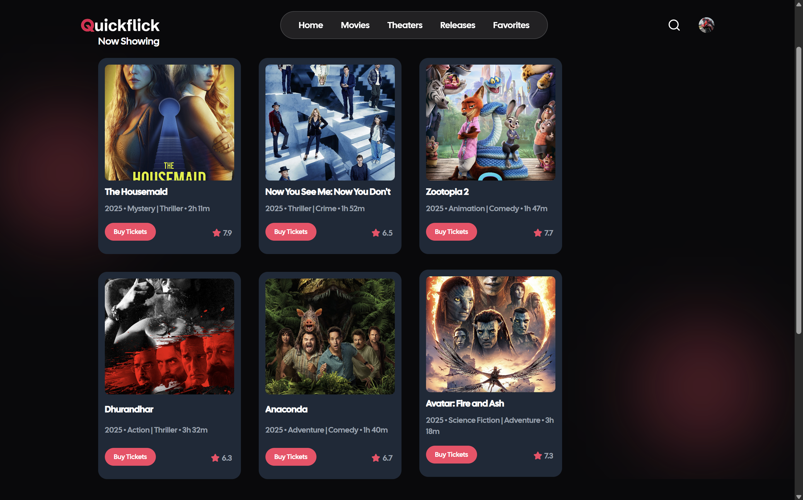
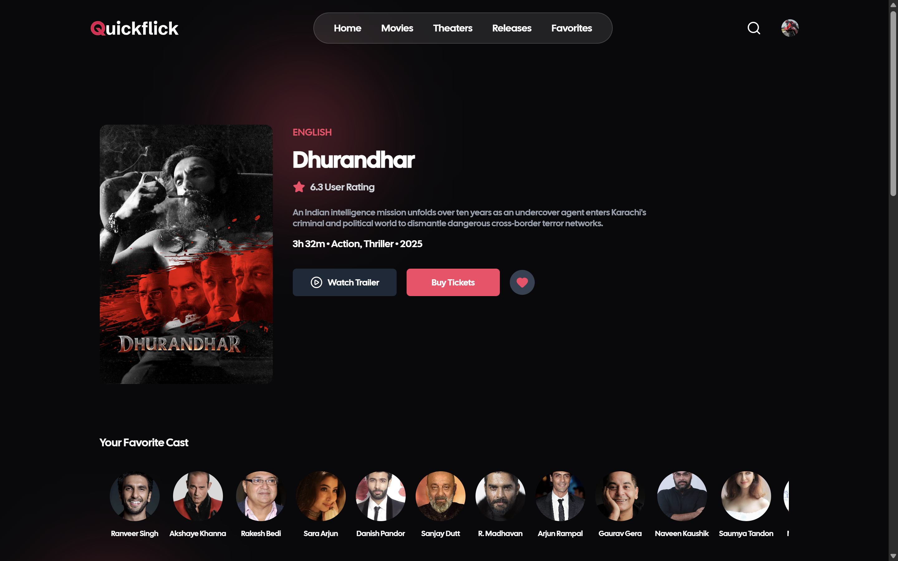
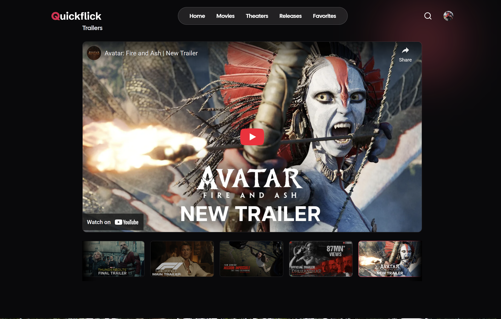
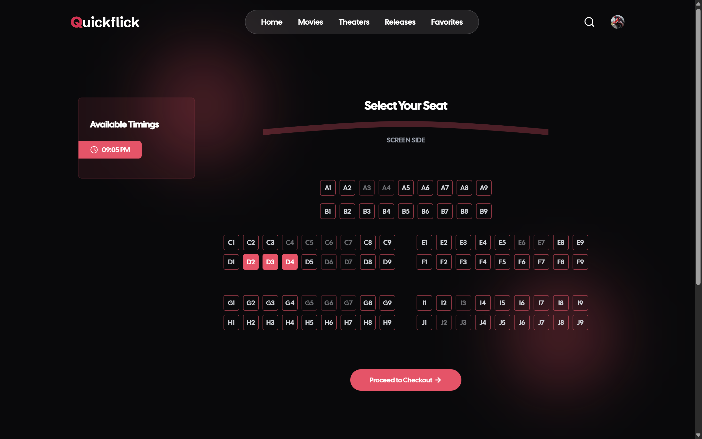
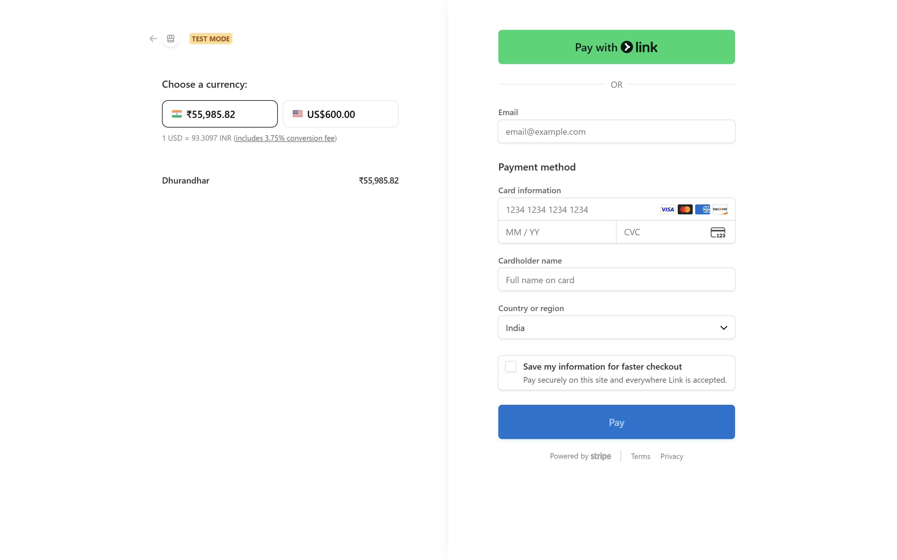
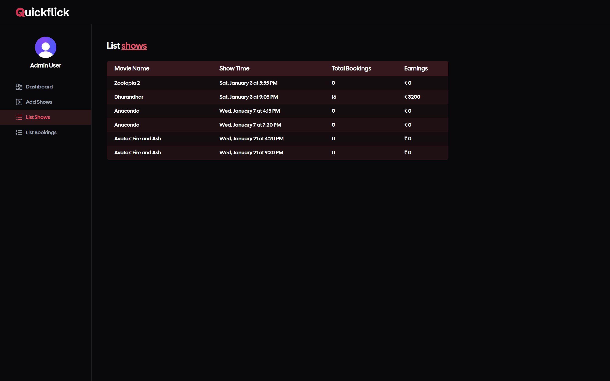
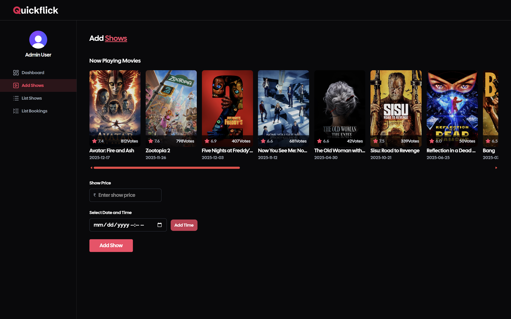
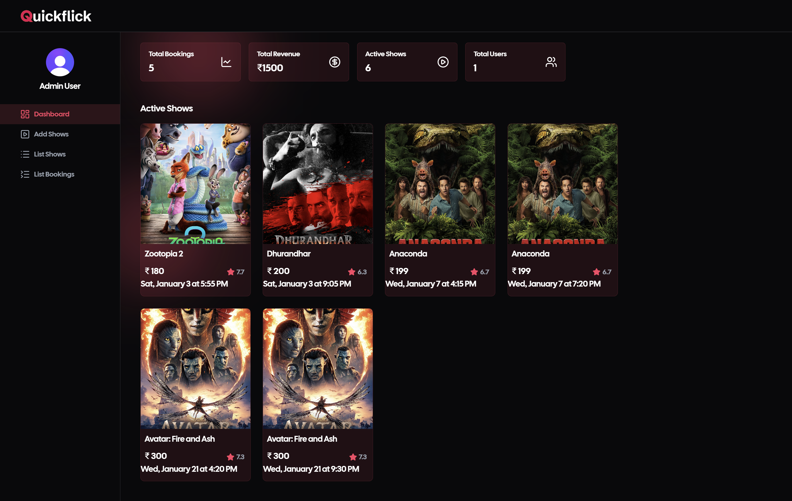

# 🎬 QuickFlick — Movie Ticket Booking Platform

QuickFlick is a full-stack **movie ticket booking web application** built using the **MERN stack**, featuring real-time seat booking, secure payments, authentication, and automated email notifications.  
The platform supports both **user and admin workflows**, dynamic seat locking, and show data powered by the TMDB API.

🔗 **Live Demo:** https://quickflick-sigma.vercel.app

---

## 🚀 Key Features

### 👤 User Features
- Browse movies and shows fetched dynamically from **TMDB API**
- Select showtimes and choose seats in real time
- **Dynamic seat locking** during checkout
- Automatic **seat release after 10 minutes** if payment is not completed
- Secure payments using **Stripe**
- **Booking confirmation emails**
- **Show reminder emails** before the movie time
- View booking history

### 🛠 Admin Features
- Add and manage movies and shows
- Configure show timings and pricing
- View bookings and analytics
- Prevent double-booking using seat state management

---

## 🔐 Authentication & Payments
- **Clerk** for authentication and user management
- **Stripe Payment Gateway** for secure transactions
- Server-side validation for booking and payment workflows

---

## 📧 Email Automation
- Booking confirmation emails
- Automated show reminder emails
- SMTP-based transactional email system (Brevo)

---

## 🧠 Seat Management Logic
- Seats are temporarily locked when a user initiates payment
- If payment is **not completed within 10 minutes**, seats are automatically released
- Prevents race conditions and double booking

---

## 🧰 Tech Stack

### Frontend

### Backend

### Database & APIs

### Authentication & Payments

### Tools & Deployment

---

## 📸 Screenshots

     <em>Home Page · Movies Listing</em> 
 
     <em>Movie Details · Trailers Section</em> 
 
     <em>Seat Selection · Stripe Payment Page</em> 
 
     <em>Admin Show Management · Add Shows</em> 
 
    <em>Admin Dashboard</em> 

📁 Project Structure
quickflick/
├── backend/
│   ├── controllers/        # Business logic
│   ├── models/             # Mongoose schemas
│   ├── routes/             # REST API routes
│   ├── services/           # Stripe, Email, TMDB integrations
│   ├── middlewares/        # Auth, admin checks, error handling
│   ├── utils/              # Seat locking & schedulers
│   ├── config/             # DB & SMTP configuration
│   └── server.js           # Backend entry point
│
├── frontend/
│   ├── src/
│   │   ├── components/     # Reusable UI components
│   │   ├── pages/          # Application pages
│   │   ├── layouts/        # User & Admin layouts
│   │   ├── services/       # API calls
│   │   ├── hooks/          # Custom hooks
│   │   ├── utils/          # Helpers
│   │   └── App.jsx
│   └── main.jsx
│
├── screenshots/            # README screenshots
├── .env.example
└── README.md

🏗️ System Architecture
┌───────────────┐
│   Frontend    │
│   (React)     │
└───────┬───────┘
        │ HTTPS
        ▼
┌───────────────┐
│    Backend    │
│   (Express)   │
└───────┬───────┘
        │
 ┌──────┼───────────────┐
 │      │               │
 ▼      ▼               ▼
MongoDB Stripe API     TMDB API
 │        │               │
 ▼        ▼               ▼
Bookings Payments     Movies & Shows
 │
 ▼
Brevo SMTP (Emails)

🔄 Application Flow
🎟 Booking & Payment Flow

User selects movie, showtime, and seats

Backend temporarily locks selected seats

Stripe checkout session is created

User completes payment

Booking is confirmed in MongoDB

Confirmation email is sent

If payment is not completed within 10 minutes, seats are released automatically

⏱ Seat Locking Logic

Seats are marked as locked during checkout

Background job tracks pending bookings

Locks expire after 10 minutes if unpaid

Prevents race conditions and double booking

🔐 Authentication Flow

Authentication handled by Clerk

Frontend uses Clerk session tokens

Backend validates protected routes

Admin routes are role-restricted

⚙️ Environment Variables
Backend (backend/.env)
MONGO_URI=your_mongodb_connection_string
STRIPE_SECRET_KEY=your_stripe_secret_key
SMTP_USER=apikey
SMTP_PASS=your_brevo_smtp_key
SENDER_EMAIL=your_verified_sender_email

Frontend (frontend/.env)
VITE_API_URL=your_backend_url
VITE_CLERK_PUBLISHABLE_KEY=your_clerk_publishable_key
VITE_STRIPE_PUBLIC_KEY=your_stripe_public_key
VITE_TMDB_API_KEY=your_tmdb_api_key

🧩 Design Principles

RESTful API design

Separation of concerns

Secure payment workflows

Scalable data models

Production-ready error handling

Concurrency-safe seat management

💡 Why This Architecture?

Easy to scale with offers, seat categories, and PWA support

Handles real-world booking concurrency

Cleanly aligns with SDE-1 system design expectations

🔮 Future Enhancements
Seat category pricing (Gold / Silver / Platinum)

Coupon and offer system

QR-code based ticket validation

PWA support for mobile users

🙌 Acknowledgements
Movie data powered by TMDB API

Project inspired by GreatStack MERN Movie Booking series

Built and extended by Suraj M

📜 License
This project is licensed under the MIT License.
